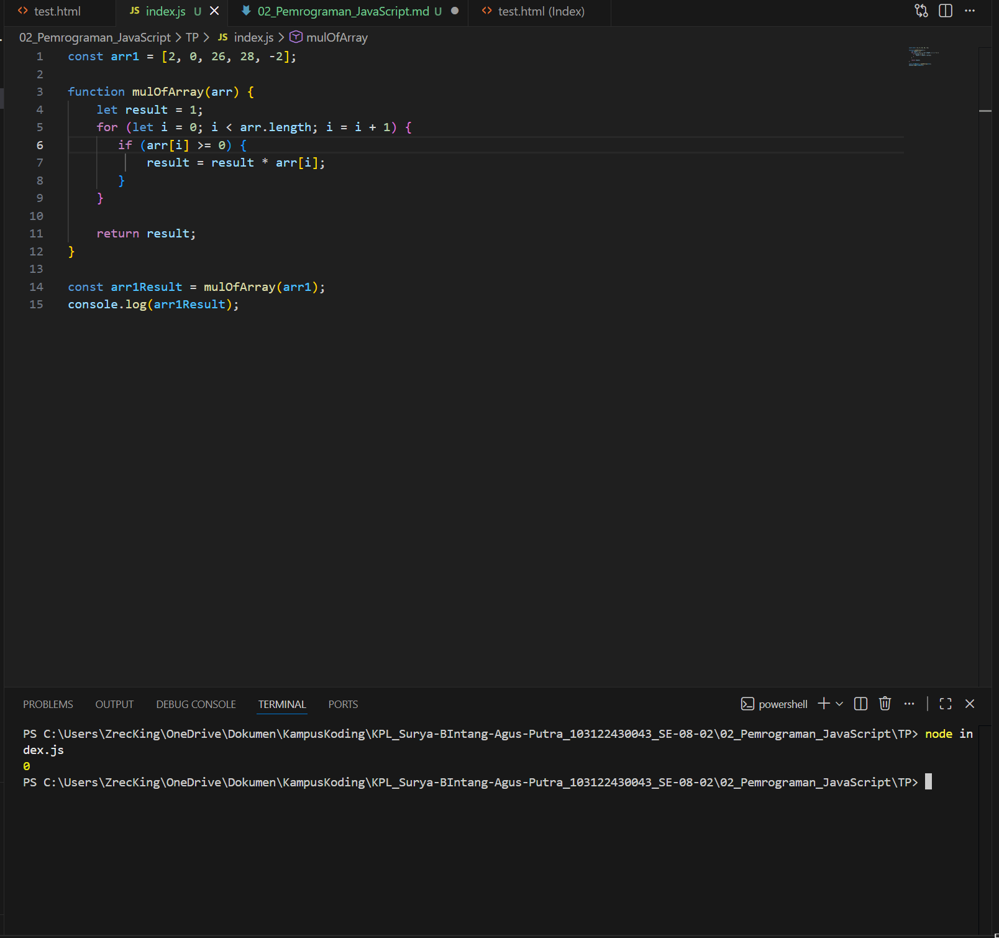
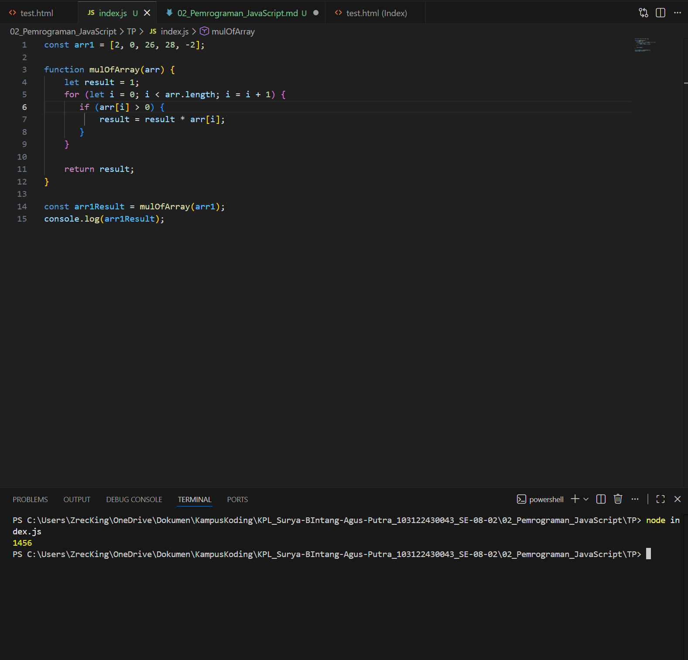

Soal

Kamu sudah menulis fungsi mulOfArray. Ujilah dengan input [2, 0, 26, 28, -2], dengan output yang seharusnya adalah 1456. Jika kamu menemukan bahwa hasilnya berbeda, bisakah kamu memperbaikinya? Jika kamu menemukan bahwa hasilnya sama, bisakah kamu menjelaskan mengapa demikian?

Jawab

Kode Pemograman Tersedia di [index.js](index.js)

di karenakan program awal ini berfungsi hanya untuk mensortir angka positif bukan di atas 0 yang menggakibatkan saat perkalian dengan 0 maka hasil nya akan selalu 0

```
        if (arr[i] >= 0) {
                result = result * arr[i];
                }
```

maka harus di perbaiki algoritma nya menjadi
```
        if (arr[i] > 0) {
                result = result * arr[i];
                }
```

Output

Sebelum di perbaiki



setelah di perbaiki



kesimpulan nya
pada algoritma pertama selalu menghasilkan 0 di karena angka 0 tidak tersoortir
dan di perbaiki dengan menghilang kan `=` pada algoritma pertama dari semuala `if (arr[i] >= 0)` menjadi `if (arr[i] > 0)`