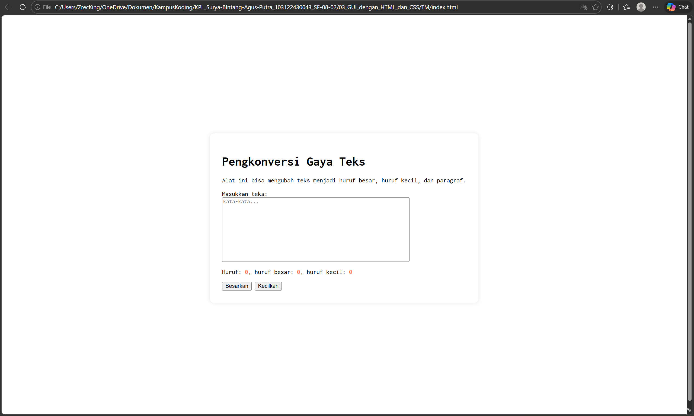
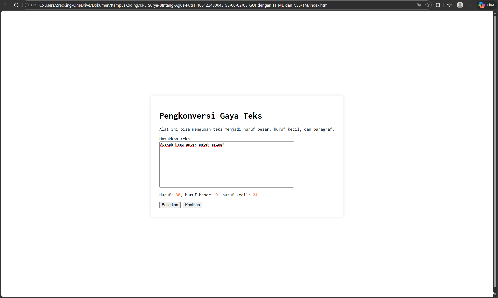
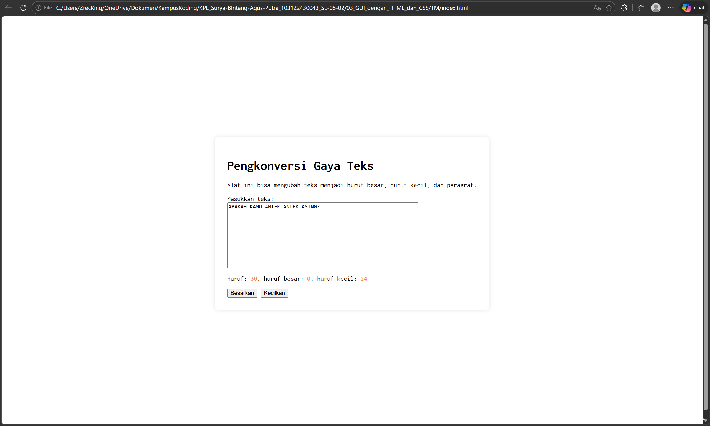

# TM 03_GUI_dengan_HTML_dan_CSS

**Nama:** Surya Bintang Agus Putra
**NIM:** 103122430043
**Kelas:** S1SE-08-02
**Dosen pengampu:** Yudha Islami Sulistiya
**Asisten Praktikum:** Adhiansyah Ancha & Hamid Khaeruman

## Soal

Setelah kamu menyelesaikan tugas pendahuluan (bisa buka di atas), terapkanlah fungsi untuk (1) menghitung huruf kecil yang disediakan di #hk, (2) mengubah huruf kecil ke huruf besar ketika pengguna menekan tombol #huruf-besar, dan (3) mengubah huruf besar ke huruf kecil ketika pengguna menekan tombol #huruf-kecil. Untuk nomor 2 dan 3, tampilkan hasilnya di dalam editor-kecil. Kemudian, hapuslah fitur "Paragrafkan" dari alat.

## Kode Sumber

Kode bisa dicek disini [index.html](./index.html) , [index.js](./index.js) dan , [index.css](./index.css)

## Output
  

## Deskripsi

Dokumen ini menjelaskan serangkaian modifikasi yang dilakukan pada alat pengolah teks yang telah dikembangkan sebelumnya. Perubahan pertama difokuskan pada penambahan fungsi statistik, di mana sistem kini mampu menghitung jumlah huruf kecil secara otomatis dari teks yang diinput ke dalam textarea dan menampilkan hasilnya pada elemen ber-ID #hk. Selain fungsi penghitungan, alat ini juga dilengkapi dengan fitur transformasi karakter melalui dua tombol utama. Tombol #huruf-besar berfungsi untuk mengubah seluruh huruf kecil dalam teks menjadi huruf besar, sedangkan tombol #huruf-kecil digunakan untuk mengubah huruf besar menjadi huruf kecil. Kedua hasil transformasi tersebut akan langsung diperbarui dan ditampilkan kembali pada area editor. Sebagai bagian dari penyederhanaan fungsi, fitur "Paragrafkan" yang ada pada versi sebelumnya telah resmi dihapus, sehingga saat ini aplikasi hanya berfokus pada penghitungan dan pengubahan format besar-kecil huruf.