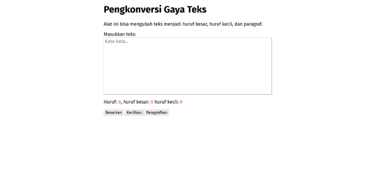
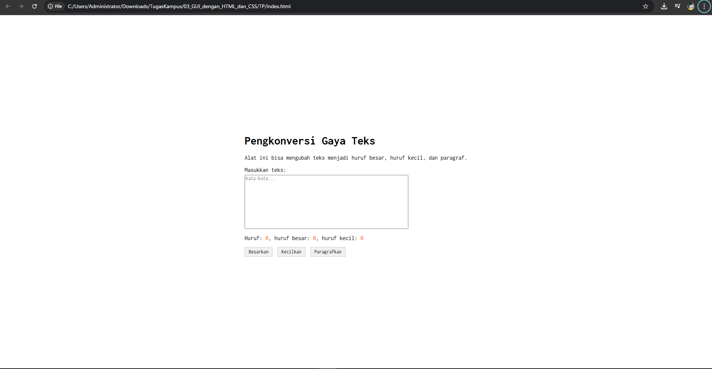

# TM 03_GUI_dengan_HTML_dan_CSS

**Nama:** Surya Bintang Agus Putra
**NIM:** 103122430043
**Kelas:** S1SE-08-02
**Dosen pengampu:** Yudha Islami Sulistiya
**Asisten Praktikum:** Adhiansyah Ancha & Hamid Khaeruman

## Soal

Buatlah tata letak laman yang kamu buat berada di tengah seperti di bawah ini, dan juga ubah font-nya dengan Inconsolata dari Google Fonts.

## Kode Sumber

Kode Pemograman Tersedia di
[index.js](index.js)
[index.css](index.css)
[index.html](index.html)

## Output

## Deskripsi

Program ini adalah aplikasi berbasis web sederhana yang dirancang untuk mengolah dan memanipulasi teks secara interaktif. Melalui antarmuka yang bersih dengan font Inconsolata, pengguna dapat memasukkan teks ke dalam area editor yang tersedia, di mana program akan secara otomatis menghitung dan menampilkan statistik jumlah huruf total, jumlah huruf besar, serta jumlah huruf kecil secara real-time. Selain berfungsi sebagai alat pemantau karakter, aplikasi ini menyediakan tombol kontrol untuk mengubah format seluruh teks menjadi huruf besar (kapital) atau huruf kecil secara instan, serta fitur untuk merapikan teks ke dalam format paragraf. Program ini sangat berguna bagi penulis atau editor yang memerlukan alat cepat untuk menyesuaikan tipografi dan memantau komposisi karakter dalam tulisan mereka.