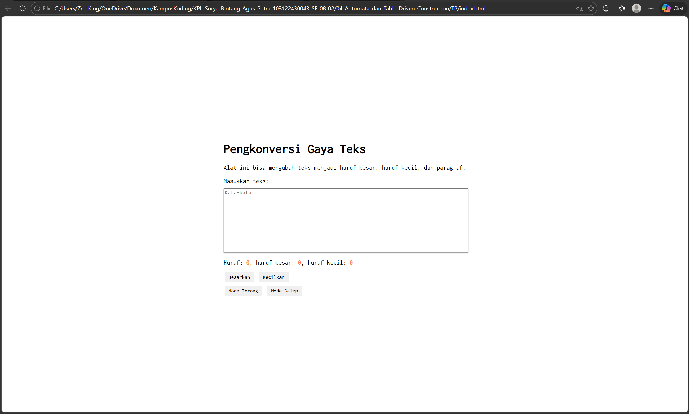
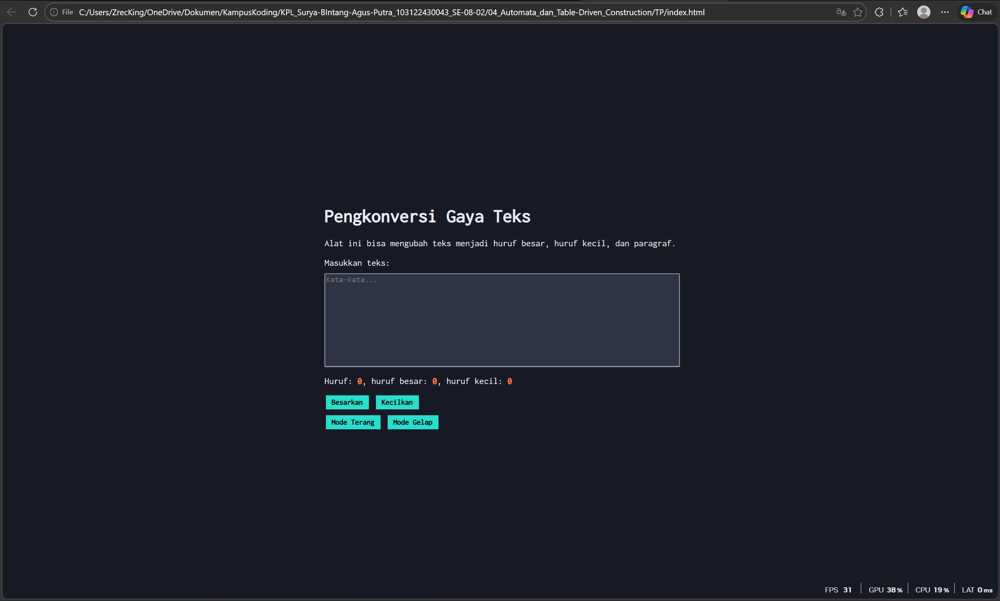

# TM 04_Automata_dan_Table-driven_Construction

**Nama:** Surya Bintang Agus Putra
**NIM:** 103122430043
**Kelas:** S1SE-08-02
**Dosen pengampu:** Yudha Islami Sulistiya
**Asisten Praktikum:** Adhiansyah Ancha & Hamid Khaeruman

## Soal

Tambahkan mode gelap sekaligus untuk editor-kecil dan tombol-tombolnya. Ketentuan warna untuk latar belakang editor-kecil adalah #2e3443, sementara untuk tombol adalah #29ddcc. Teks untuk tombol tetap mengikuti warna teks sebelumnya.

Untuk menghapus pinggiran tombol, nyatakan properti `border` untuk tidak ditunjukkan.

## Kode Sumber

Kode bisa dicek disini [index.html](./index.html) , [index.js](./index.js) dan , [index.css](./index.css)

## Output
 

## Deskripsi

Dokumen ini menjelaskan implementasi fitur Mode Terang dan Mode Gelap pada halaman web menggunakan kombinasi HTML, CSS, dan JavaScript. Fitur ini memungkinkan pengguna mengubah tema tampilan secara instan melalui dua tombol navigasi.

Jadi saya menambahkan dua tombol baru dengan ID #tombol-terang dan #tombol-gelap sebagai pemicu perubahan tema.

Caranya dengan menggunakan class .mode-gelap untuk mengatur ulang skema warna. Jadi saat aktif, latar belakang halaman berubah menjadi gelap (#171b25), area input menjadi kontras (#2e3443), dan tombol menggunakan warna aksen hijau toska (#29ddcc) tanpa garis tepi (border).

Sistem di javasriptnya sebagai berikut:
Aktif: Saat tombol gelap diklik, fungsi classList.add menyematkan class .mode-gelap ke elemen utama (document.documentElement).

Nonaktif: Saat tombol terang diklik, fungsi classList.remove menghapus class tersebut sehingga tampilan kembali ke pengaturan awal (mode terang).