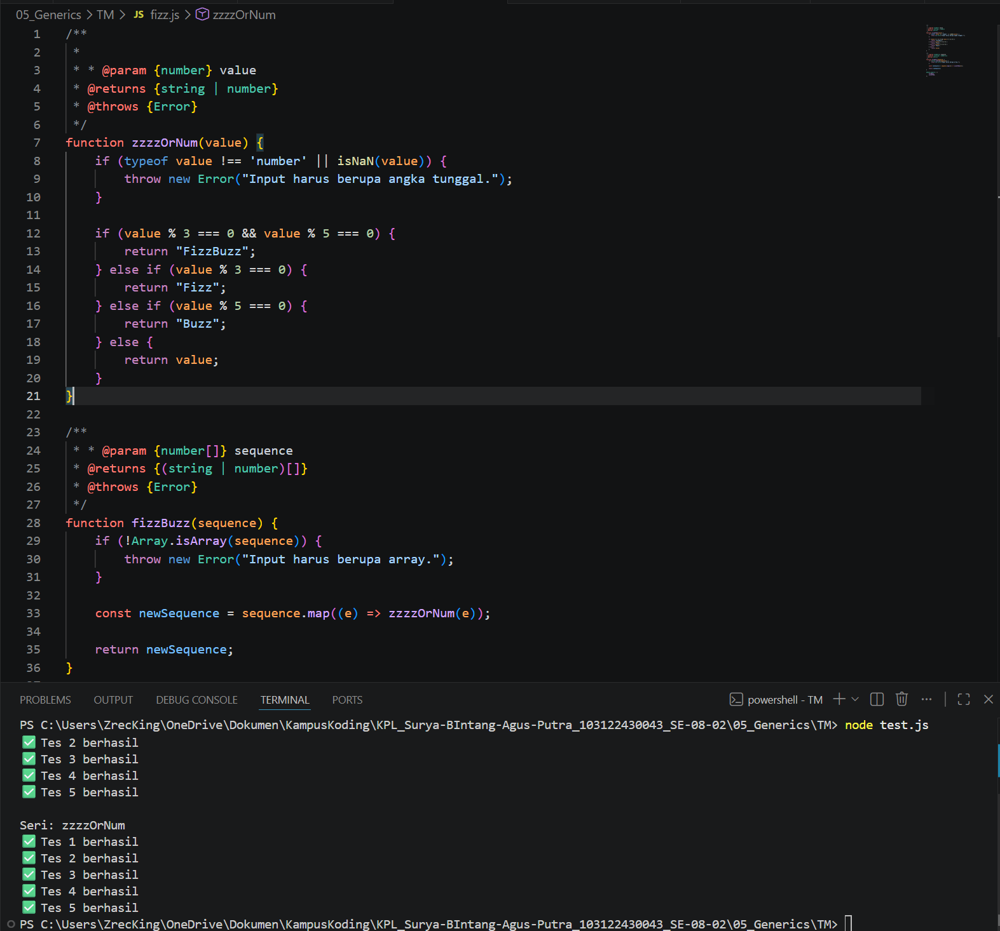

# TM 04_Automata_dan_Table-driven_Construction

**Nama:** Surya Bintang Agus Putra
**NIM:** 103122430043
**Kelas:** S1SE-08-02
**Dosen pengampu:** Yudha Islami Sulistiya
**Asisten Praktikum:** Adhiansyah Ancha & Hamid Khaeruman

## Soal

Diberikan program index.js seperti ini:
// Tambah JSDoc di sini
function zzzzOrNum(value) {
    // Ubah kode di sini
}

// Tambah JSDOC di sini
function fizzBuzz(sequence) {
    // Ubah kode di sini

    const newSequence = sequence.map((e) => zzzzOrNum(e));

    return newSequence;
}

module.exports = {
    fizzBuzz: fizzBuzz,
    zzzzOrNum: zzzzOrNum,
};

Aturan FizzBuzz kali ini adalah:
1. Fungsi fizzBuzz hanya menerima larik yang semua elemennya terdiri dari bilangan bulat dan mengeluarkan larik pula yang bisa jadi bercampur string dan bilangan
2. Fungsi zzzzOrNum hanya menerima sebuah data tunggal berupa bilangan bulat dan mengembalikan "Fizz", "FizzBuzz", "Buzz", atau bilanga bulat sesuai logikanya
3. Kedua fungsi harus ada dan harus disertai JSDoc sesuai tipe data yang disiratkan dari no. 1, no. 2, dan perilaku yang diharapkan di bawah
4. fizzBuzz harus menggunakan fungsi zzzzOrNum di dalamnya

Gunakan konfigurasi ini untuk [tsconfig.json](./tsconfig.json) dan [test.js](./test.js) ini untuk menguji kode yang kamu buat.

Jika ada kendala atau kejanggalan, hubungi segara ya.

## Kode Sumber

Kode bisa dicek disini [fizz.html](./fizz.js)

## Output

## Deskripsi

Dokumen ini menjelaskan implementasi dua fungsi utama, yaitu zzzzOrNum dan fizzBuzz, yang dirancang untuk mengelola transformasi bilangan bulat menjadi label string tertentu berdasarkan aturan pembagian matematika. Kode ini menggunakan pendekatan modular di mana satu fungsi berfungsi sebagai unit logika terkecil, dan fungsi lainnya bertindak sebagai pengelola koleksi data.