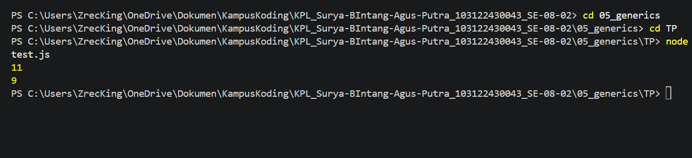

# TM 04_Automata_dan_Table-driven_Construction

**Nama:** Surya Bintang Agus Putra
**NIM:** 103122430043
**Kelas:** S1SE-08-02
**Dosen pengampu:** Yudha Islami Sulistiya
**Asisten Praktikum:** Adhiansyah Ancha & Hamid Khaeruman

## Soal

Ini adalah kode yang mengurus jumlah semua karakter dan jumlah huruf:
const str = "Bar bar";

let jumlahSemua = 0;
for (const c of str) { 
    jumlahSemua++; 
}
console.log(total);

let jumlahHuruf = 0;
for (const c of str) { 
    if (c === ' ') continue;
    jumlahHuruf++;
}
console.log(letters);

Bagaimana caramu hanya dengan satu fungsi generik bisa mengurus keduanya?

Agar fungsi yang kamu kerjakan benar atau tidak, berikut ini adalah kode tes yang bisa kamu tempelkan:
const str = "Bar bar bar";
...
console.log(
   hitung(str, "semua") // Harusnya 11
);

console.log(
  hitung(str, "huruf") // Harusnya 9
);

hitung(str, "huruf"); // Tidak terjadi apa-apa

## Kode Sumber

Kode bisa dicek disini [index.html](./index.js) ,dan [index.js](./test.js)

## Output

## Deskripsi

Dokumen ini menjelaskan implementasi fungsi generik bernama hitung yang dirancang untuk mengelola perhitungan karakter pada string dengan dua mode berbeda melalui satu logika terpadu. Fungsi ini memungkinkan sistem untuk menghitung seluruh panjang karakter atau hanya menghitung jumlah huruf saja dengan mengabaikan spasi.

Dalam struktur kodenya, saya menggunakan parameter str sebagai input teks dan parameter tipe sebagai instruksi mode perhitungan. Variabel count digunakan sebagai penampung angka yang dimulai dari nol untuk mencatat hasil akhir.