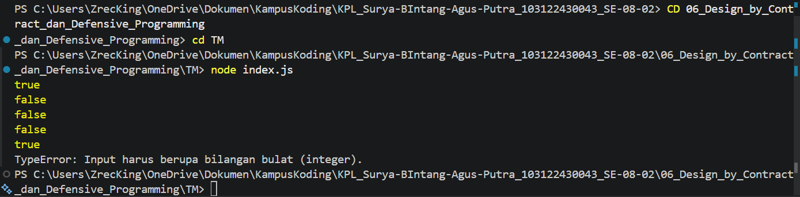

# TM 04_Automata_dan_Table-driven_Construction

**Nama:** Surya Bintang Agus Putra
**NIM:** 103122430043
**Kelas:** S1SE-08-02
**Dosen pengampu:** Yudha Islami Sulistiya
**Asisten Praktikum:** Adhiansyah Ancha & Hamid Khaeruman

## Soal

Lindungi kode ini dari bilangan-bilangan "fizz buzz"!

Tugasmu adalah membuat fungsi yang menolak bilangan-bilangan kelipatan 3, 5, atau 15, menerima bilangan-bilangan bukan "fizz buzz", dan melempar yang bukan bilangan bulat.

function is_not_fizzbuzz(number) {
  // TODO
}

console.log(is_not_fizzbuzz(1)) // true
console.log(is_not_fizzbuzz(3)) // false
console.log(is_not_fizzbuzz(5)) // false
console.log(is_not_fizzbuzz(30)) // false
console.log(is_not_fizzbuzz(7)) // true
console.log(is_not_fizzbuzz(null)) // Lempar TypeError
console.log(is_not_fizzbuzz(NaN)) // Lempar TypeError
console.log(is_not_fizzbuzz(Infinity)) // Lempar TypeError

## Kode Sumber

Kode bisa dicek disini [index.html](./index.js)

## Output

## JAWABAN

Kode ini dirancang untuk memvalidasi input sekaligus menerapkan logika penyaringan angka kelipatan tertentu dalam satu alur fungsi. Pertama, fungsi melakukan validasi tipe data menggunakan Number.isInteger() untuk memastikan bahwa input yang diterima benar-benar merupakan bilangan bulat; jika input tidak valid (seperti null, NaN, atau Infinity), program akan segera melempar TypeError untuk mencegah kesalahan proses lebih lanjut. Setelah lolos validasi, kode menggunakan operator modulo (%) untuk memeriksa apakah angka tersebut habis dibagi 3 atau 5. Jika angka tersebut merupakan kelipatan dari salah satu atau kedua bilangan tersebut—termasuk kelipatan 15—fungsi akan mengembalikan nilai false, sedangkan untuk angka bulat lainnya, fungsi akan mengembalikan nilai true.