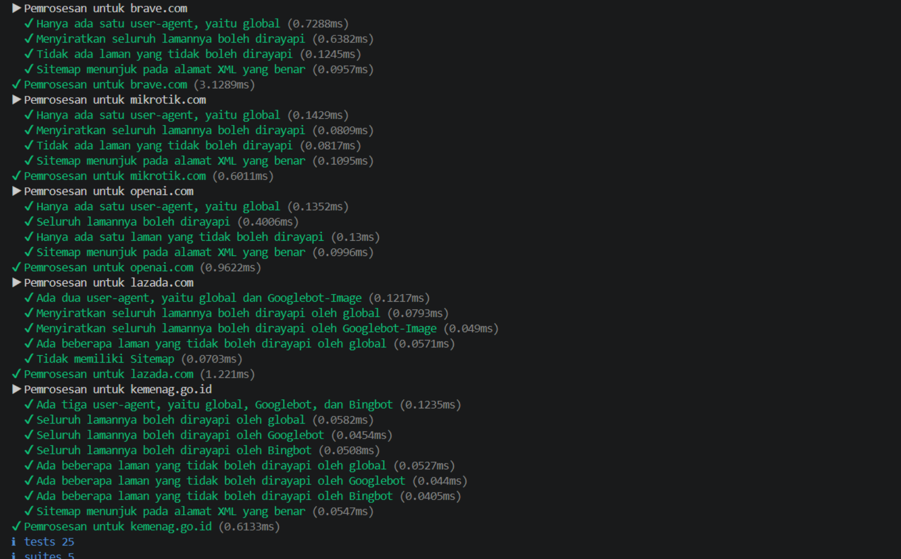
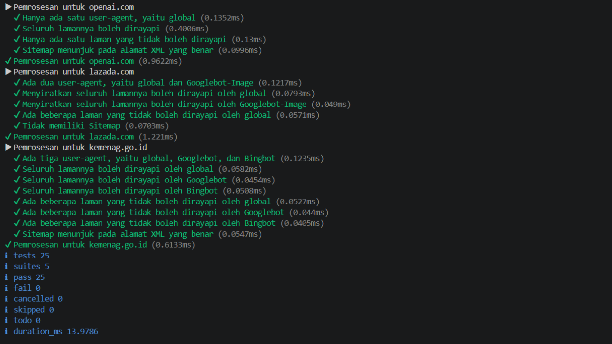

# TM 04_Automata_dan_Table-driven_Construction

**Nama:** Surya Bintang Agus Putra
**NIM:** 103122430043
**Kelas:** S1SE-08-02
**Dosen pengampu:** Yudha Islami Sulistiya
**Asisten Praktikum:** Adhiansyah Ancha & Hamid Khaeruman

## Soal

Tugas pada kesempatan kali ini adalah membuat fungsi yang menguraikan isi robots.txt menjadi POJO (plain old JavaScript object). Empat properti yang perlu diuraikan dijabarkan di bawah berikut.

User-agent adalah nama robot perayapnya
Allow adalah daftar halaman-halaman yang boleh dirayap
Disallow adalah daftar halaman-halaman yang tidak boleh dirayap
Sitemap adalah sebuah pranala yang menunjuk pada "denah" situs web (biasanya berformat XML)

## Kode Sumber

Kode bisa dicek disini [index.html](./index.js) [test.html](./test.js) [structure.html](./structure.d.ts)

## Output
 

## JAWABAN

Fungsi ini bertugas membedah (parsing) isi file robots.txt yang mentah menjadi sebuah objek JavaScript yang terstruktur dan mudah diolah. Kode bekerja dengan memproses teks baris demi baris, mengabaikan komentar, lalu secara cerdas mengelompokkan aturan Allow dan Disallow sesuai dengan target botnya (User-agent). Selain itu, fungsi ini juga mengekstraksi informasi penting lainnya seperti lokasi Sitemap dan domain Host, sehingga instruksi akses situs bagi mesin pencari dapat dibaca secara sistematis oleh aplikasi.