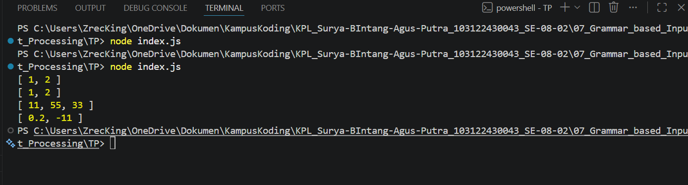

# TM 04_Automata_dan_Table-driven_Construction

**Nama:** Surya Bintang Agus Putra
**NIM:** 103122430043
**Kelas:** S1SE-08-02
**Dosen pengampu:** Yudha Islami Sulistiya
**Asisten Praktikum:** Adhiansyah Ancha & Hamid Khaeruman

## Soal

Buatlah fungsi yang mengubah deretan angka bertipe string menjadi larik angka.

function toNumberArray(number) {
  // TODO
}

console.log(toNumberArray("1, 2")) // [1, 2]
console.log(toNumberArray(["1", "2"])) // [1, 2]
console.log(toNumberArray(" 11,55,33   ")) // [11, 55, 33]
console.log(toNumberArray(["0.2", "-11", "abc23"])) // [0.2, -11]

## Kode Sumber

Kode bisa dicek disini [index.html](./index.js)

## Output

## JAWABAN

Kode ini berfungsi untuk mentransformasi data mentah yang berisi karakter teks menjadi sebuah daftar angka yang bersih dan siap diolah. Proses diawali dengan mendeteksi bentuk input; jika data masuk sebagai teks panjang dengan koma, kode akan memecahnya menjadi potongan-potongan kecil, namun jika sudah berbentuk daftar, kode akan langsung memproses isinya. Selanjutnya, setiap potongan teks tersebut dibersihkan dari spasi liar dan dikonversi menjadi tipe data angka secara otomatis. Terakhir, kode melakukan penyaringan ketat untuk membuang elemen yang tidak valid atau bukan angka murni, sehingga hasil akhirnya hanya menyisakan deretan angka yang sah dalam format array.