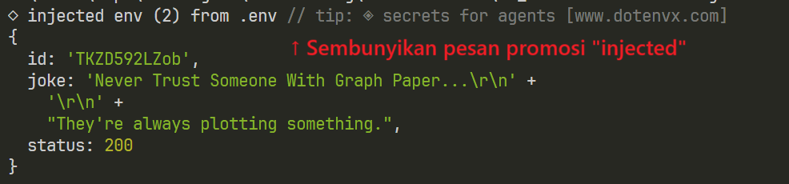
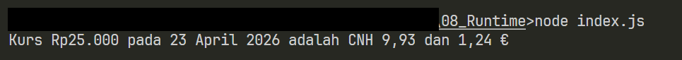
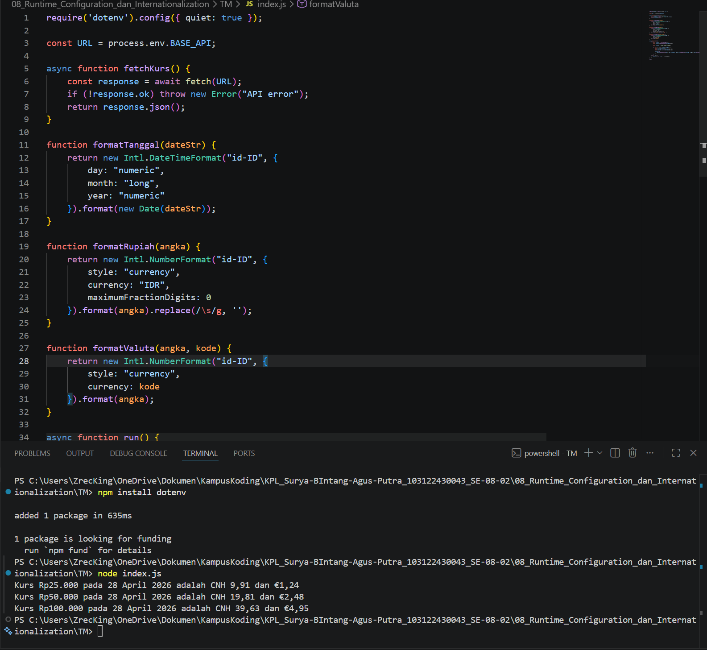

# TM 04_Automata_dan_Table-driven_Construction

**Nama:** Surya Bintang Agus Putra
**NIM:** 103122430043
**Kelas:** S1SE-08-02
**Dosen pengampu:** Yudha Islami Sulistiya
**Asisten Praktikum:** Adhiansyah Ancha & Hamid Khaeruman

## Soal

Waktunya menukar uang!

Pada tugas ini kamu akan membuat program yang menampilkan kurs rupiah (IDR) terhadap renminbi luar Tiongkok (CNH) dan euro (EUR). Gunakan link API ini untuk mengambil data.

Tantangan

1. Simpanlah URL API ke dalam .env sebagai BASE_API

2. Gunakan Intl untuk memformat nilai mata uang dan waktu kamu mengambil data kurs.

3. Hapus pesan promosi dotenv

Lalu pastikan outputnya tampak seperti di bawah ini.

Ujilah dengan Rp25000, Rp50000, dan Rp100000.

## Kode Sumber

Kode bisa dicek disini [index.html](./index.js)

## Output

## JAWABAN

Kode ini adalah sebuah program Node.js yang bertugas mengambil data kurs mata uang dari sebuah API, lalu mengonversi nilai Rupiah ke mata uang asing dan menampilkannya ke konsol.
Program dimulai dengan memuat konfigurasi lingkungan menggunakan dotenv, lalu mengambil URL API dari variabel lingkungan BASE_API. Fungsi fetchKurs() bertugas memanggil API tersebut dan mengembalikan data kurs dalam format JSON. Jika permintaan gagal, fungsi ini akan melempar error.

Terdapat tiga fungsi pembantu untuk memformat tampilan. formatTanggal() mengubah string tanggal menjadi format panjang bahasa Indonesia, misalnya "28 April 2026". formatRupiah() memformat angka menjadi mata uang Rupiah tanpa spasi, dan formatValuta() memformat angka ke mata uang asing sesuai kode yang diberikan (misalnya CNH atau EUR).

Fungsi utama run() menjalankan seluruh alur program. Ia mengambil data kurs, lalu melakukan perulangan terhadap tiga nilai uji Rupiah yaitu Rp25.000, Rp50.000, dan Rp100.000. Setiap nilai dikonversi ke Yuan Offshore (CNH) dan Euro (EUR) dengan cara mengalikannya dengan nilai kurs yang diterima dari API, kemudian hasilnya dicetak ke konsol dalam format kalimat yang sudah dilokalkan ke bahasa Indonesia. Jika terjadi kesalahan di mana pun dalam proses ini, pesan error akan ditangkap dan ditampilkan lewat console.error().