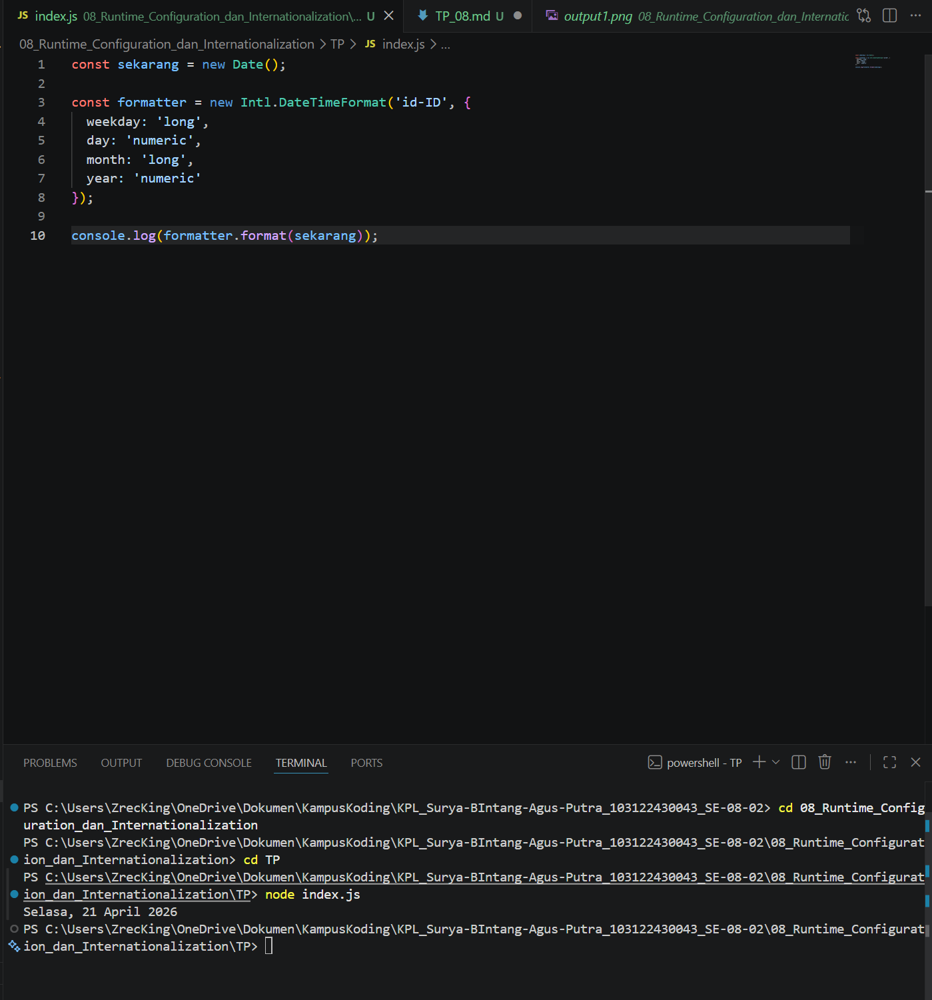

# TM 04_Automata_dan_Table-driven_Construction

**Nama:** Surya Bintang Agus Putra
**NIM:** 103122430043
**Kelas:** S1SE-08-02
**Dosen pengampu:** Yudha Islami Sulistiya
**Asisten Praktikum:** Adhiansyah Ancha & Hamid Khaeruman

## Soal

Tampilkan tanggal sekarang dengan format seperti ini:

Sabtu, 18 April 2026

Nilai waktu tidak harus sama, asalkan formatnya benar dan bisa tampil di komputer terpisah pada waktu tertentu. Gunakan Intl.DateTimeFormat (bukan string manual).

## Kode Sumber

Kode bisa dicek disini [index.html](./index.js)

## Output

## JAWABAN

Kode ini berfungsi untuk mengambil waktu saat ini dan mengubahnya menjadi format tanggal yang "manusiawi" dalam bahasa Indonesia. Dengan memanfaatkan fitur Intl.DateTimeFormat, kode tersebut secara otomatis menerjemahkan data waktu mentah menjadi susunan nama hari, tanggal, bulan, dan tahun yang rapi (contoh: Selasa, 21 April 2026) sehingga hasil yang muncul di konsol jauh lebih mudah dibaca dan dipahami.