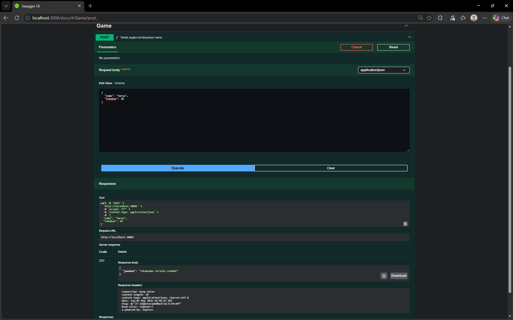
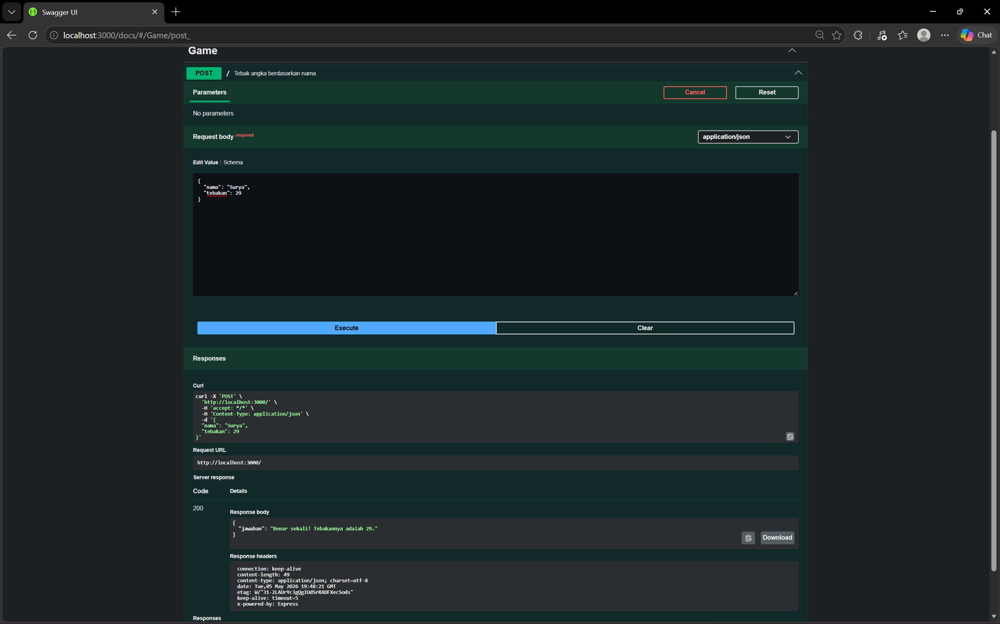

# TM 04_Automata_dan_Table-driven_Construction

**Nama:** Surya Bintang Agus Putra

**NIM:** 103122430043

**Kelas:** S1SE-08-02

**Dosen pengampu:** Yudha Islami Sulistiya

**Asisten Praktikum:** Adhiansyah Ancha & Hamid Khaeruman

## Soal

Mari kita main tebak-tebakan angka acak!

Tugasmu adalah membuat API yang terdiri dari satu endpoint saja, yaitu POST /. Ketika kita melakkukan POST, formatnya adalah seperti di bawah ini.

{
  "nama": "Hamid",
  "tebakan": 24
}
Jika tebakan benar.

{
    "jawaban": "Benar sekali! Tebakannya adalah 24."
}
Jika tebakan terlalu tinggi.

{
    "jawaban": "Tebakanmu terlalu tinggi!"
}
Jika tebakan terlalu rendah.

{
    "jawaban": "Tebakanmu terlalu rendah!"
}
Beberapa aturan:

Angka acak yang dihasilkan harus tetap dan tidak boleh berubah setiap kali permintaan API dilakukan, tetapi boleh berubah setiap harinya atau dibuat tetap selamanya
Rentang harus di antara 1-100

Nama harus sensitif terhadap besar kecil huruf (mis. hamid dan Hamid akan menghasilkan angka acak yang berbeda)
Tidak menggunakan pustaka apapun, murni mengandalkan nama dan tebakan
Penjelasan untuk nomor 1: Jika namanya Hamid, ia akan diharapkan tetap pada nilai tebakan 24 mau kamu melakukan 100 kali permintaan. Tidak ada jawaban benar di sini (Hamid tidak harus 24, bebas mau dibuat acak seperti apa yang penting harus tetap).

## Kode Sumber

Kode bisa dicek disini [index.html](./index.js)

## Output
  

## JAWABAN

Program ini adalah API sederhana berbasis Node.js dengan framework Express yang membuat permainan tebak angka dan mendokumentasikan endpoint API menggunakan Swagger UI serta swagger-jsdoc. Saat server dijalankan, aplikasi akan aktif di port 3000 dan menyediakan halaman dokumentasi di `/docs` agar endpoint dapat diuji langsung melalui browser. Program menerima input berupa nama dan angka tebakan melalui metode POST, lalu menghasilkan angka rahasia berdasarkan nama yang dimasukkan dengan mengolah nilai karakter menjadi angka antara 1–100. Setelah itu, sistem membandingkan tebakan pengguna dengan angka rahasia dan memberikan respons apakah tebakan tersebut benar, terlalu tinggi, atau terlalu rendah dalam format JSON.
