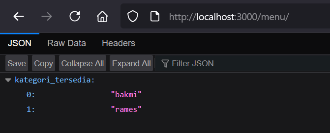
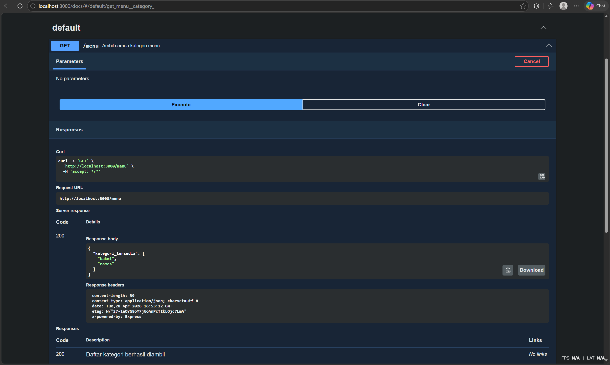
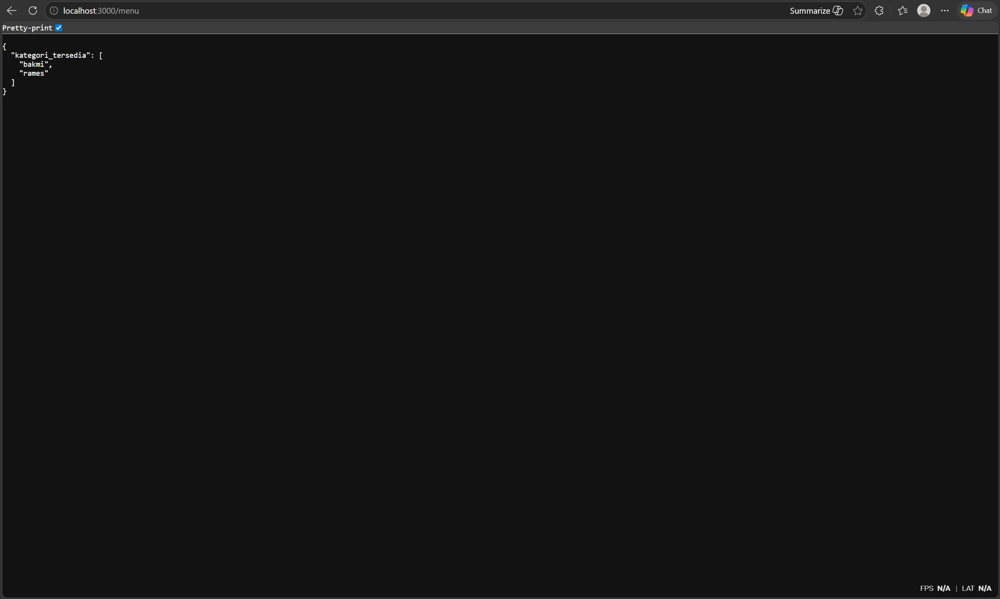

# TM 04_Automata_dan_Table-driven_Construction

**Nama:** Surya Bintang Agus Putra
**NIM:** 103122430043
**Kelas:** S1SE-08-02
**Dosen pengampu:** Yudha Islami Sulistiya
**Asisten Praktikum:** Adhiansyah Ancha & Hamid Khaeruman

## Soal

Buatlah satu endpoint lagi beserta dokumentasi OpenAPI-nya, yaitu GET /menu yang menampilkan daftar semua nama kategori menu yang ada.

Dokumentasi:

Hasil GET:

## Kode Sumber

Kode bisa dicek disini [index.html](./index.js) [swagger.html](./swagger.js)

## Output
 

## JAWABAN
Program ini adalah sebuah REST API sederhana yang dibangun menggunakan Express.js untuk menampilkan menu makanan dari sebuah warung makan. Data menu disimpan langsung di dalam objek menuData yang terbagi menjadi dua kategori, yaitu bakmi dan rames, masing-masing beserta daftar item dan harganya.

API ini memiliki tiga endpoint utama. Endpoint / hanya menampilkan pesan singkat yang mengarahkan pengguna ke halaman dokumentasi. Endpoint /menu mengembalikan daftar kategori menu yang tersedia. Endpoint /menu/:category menerima nama kategori sebagai parameter URL dan mengembalikan daftar makanan beserta harganya — jika kategori tidak ditemukan, API akan merespons dengan status 404 dan pesan error.

Selain itu, program ini juga mengintegrasikan Swagger UI melalui file swagger.js yang terpisah, sehingga dokumentasi API dapat diakses secara interaktif melalui endpoint /docs. Server dijalankan pada port 3000. Perlu dicatat, terdapat duplikasi route app.get('/menu', ...) yang didefinisikan dua kali — Express hanya akan mengeksekusi yang pertama, sehingga definisi kedua tidak akan pernah terpanggil.