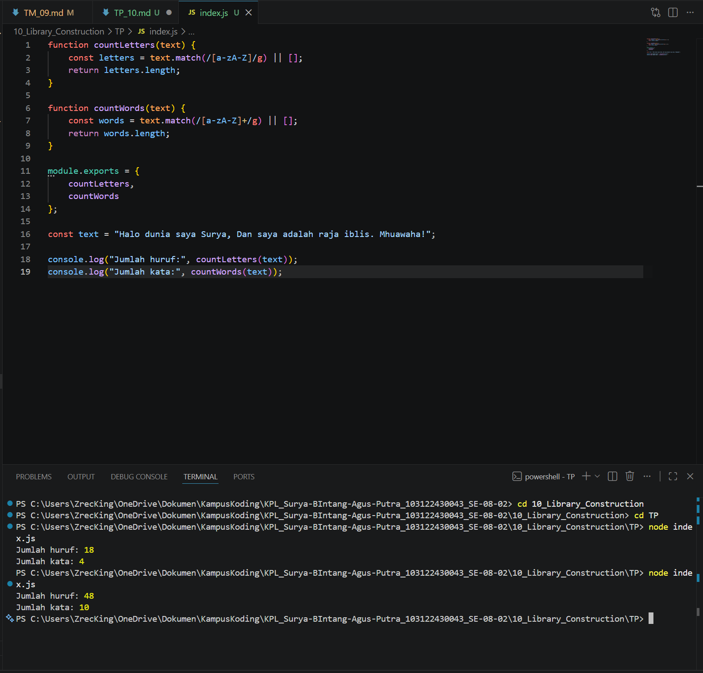

# TM 04_Automata_dan_Table-driven_Construction

**Nama:** Surya Bintang Agus Putra

**NIM:** 103122430043

**Kelas:** S1SE-08-02

**Dosen pengampu:** Yudha Islami Sulistiya

**Asisten Praktikum:** Adhiansyah Ancha & Hamid Khaeruman

## Soal

Buatlah pustaka JavaScript yang menyediakan utilitas berupa dua fungsi yang menghitung jumlah huruf dan jumlah kata.

Kriteria:

Hanya alfabet A hingga Z yang dihitung (besar dan kecil)
Spasi tidak dihitung
Pustaka bisa diimpor

## Kode Sumber

Kode bisa dicek disini [index.html](./index.js)

## Output

## JAWABAN

Program ini merupakan pustaka utilitas sederhana di JavaScript yang memiliki dua fungsi utama untuk mengolah teks. Fungsi `countLetters()` digunakan untuk menghitung jumlah huruf dalam sebuah kalimat dengan hanya mengambil karakter alfabet A–Z (huruf besar maupun kecil), sehingga spasi, angka, dan simbol tidak ikut dihitung. Sementara itu, fungsi `countWords()` digunakan untuk menghitung jumlah kata berdasarkan kumpulan huruf yang dipisahkan oleh spasi atau tanda baca. Kedua fungsi tersebut diekspor menggunakan `module.exports` agar dapat diimpor dan digunakan kembali pada file lain. Pada bagian akhir program, terdapat contoh penggunaan dengan sebuah kalimat untuk menampilkan hasil jumlah huruf dan jumlah kata ke console.

